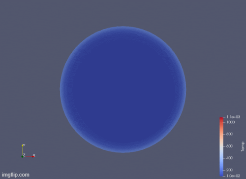
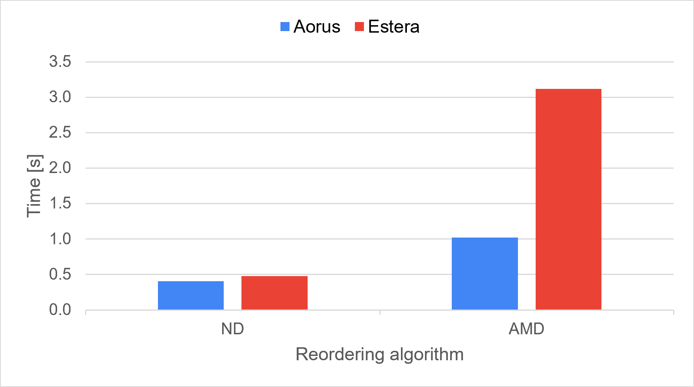
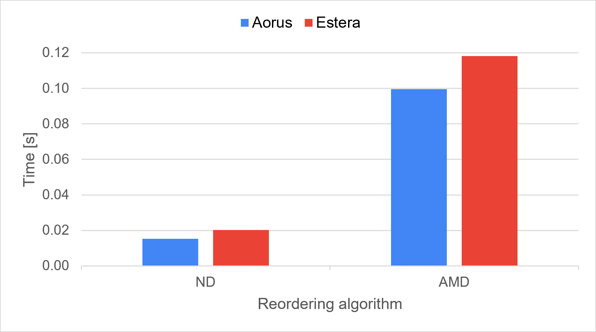
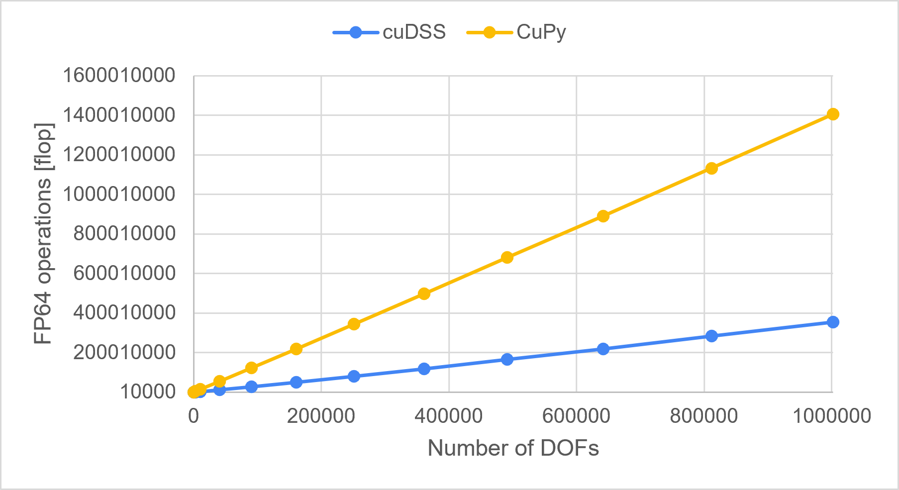
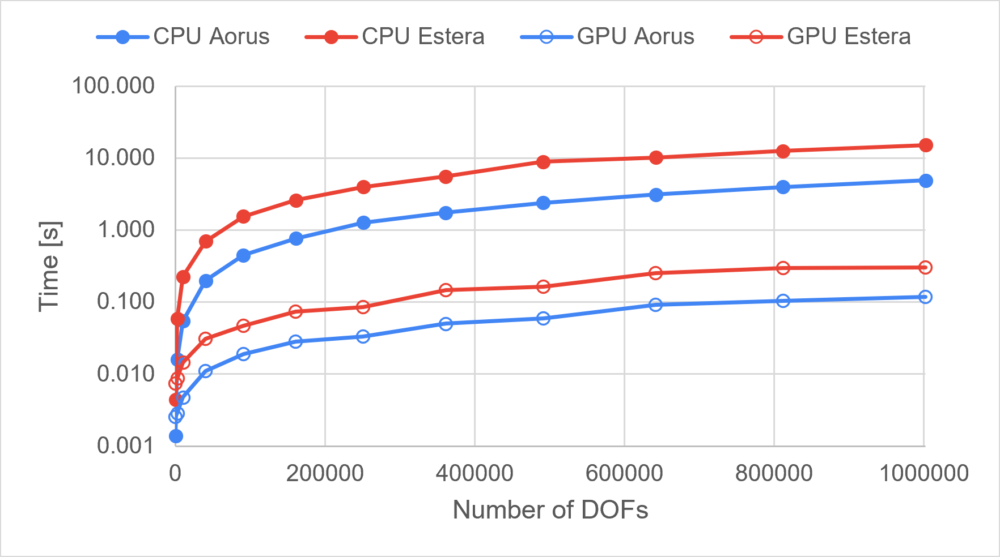
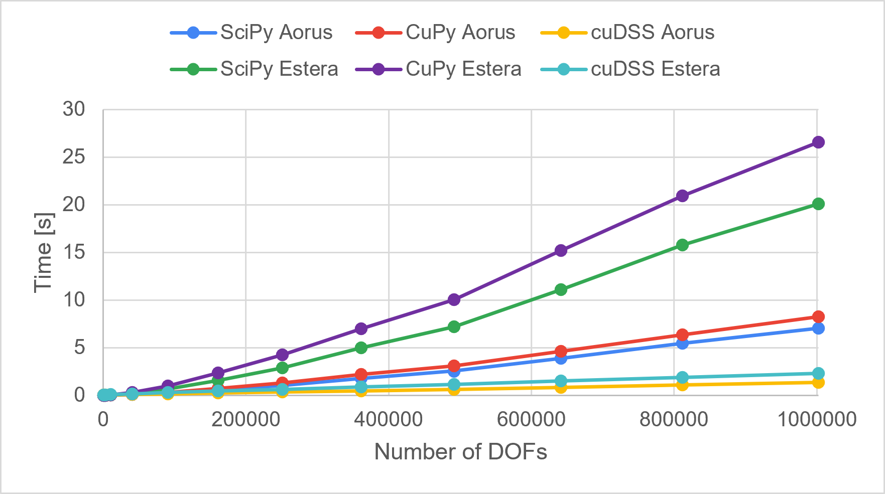
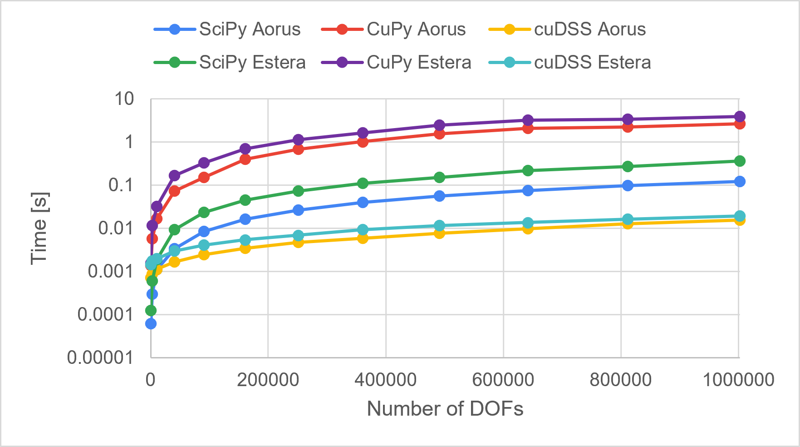

# 🚀 GPU-Accelerated Finite Element Method (FEM) Solver


## 📌 Overview & Purpose
The program is designed for modeling transient thermal phenomena in an object's cross-section during heating. It utilizes the **Finite Element Method (FEM)** applied to Fourier's heat conduction equation, incorporating Newton's boundary conditions.

**Developing a basic FEM solver was not the primary goal.** The main objective was to design, implement, and benchmark multiple variants of the code to deeply understand performance bottlenecks, memory access patterns, and the impact of different matrix reordering algorithms.

### 🎥 Simulation Output
The program generates `.vtk` files, which can be visualized in tools like ParaView.

<p align="center">
      <br />
      <sub><em>Example of a transient thermal simulation visualized in ParaView</em></sub>
</p>

---

## ⚡ Key Features & Technologies
* **Custom CUDA Kernels:** Implemented custom kernels for the calculation and initial assembly of element matrices, achieving a **speedup of several dozen times** compared to the CPU implementation.
* **Multithreaded CPU Fallback:** A fully functional CPU-based solver for performance baseline comparison.
* **Multiple Sparse Linear Solvers:** Integration and benchmarking of various sparse linear system solvers:
    * `SciPy` (CPU-based computations)
    * `CuPy` (solve phase GPU-accelerated)
    * `cuDSS` (factorization & solve phases GPU-accelerated)
* **Profiling:** Analyzed GPU kernels using **Nvidia Nsight Systems** and **Nvidia Nsight Compute**.

---

## 🔑 Key Takeaways
Performance experiments and GPU profiling yielded three primary insights regarding GPU computation efficiency.

### Bug in CuPy Sparse Module (as of v14.2.0)
I identified a bug in the `sparse` module of the CuPy library that causes massive overhead during the solve phase.

Solving a linear system of equations $[A] \lbrace x \rbrace = \lbrace b \rbrace$ using direct methods consists of 3 main steps:

| *LU (or Cholesky) decomposition* | *Forward substitution* | *Backward substitution* |
| - | - | - |
| $[A] = [L][U]$ | $[L] \lbrace c \rbrace = \lbrace b \rbrace$ | $[U] \lbrace x \rbrace = \lbrace c \rbrace$ |

NVIDIA Nsight Systems profiler revealed that **over 90%** of GPU execution time was spent in `cusparse::find_colors_kernel` function. Specifically, the cuSPARSE graph coloring algorithm analyzes the structure of coefficient matrix to plan parallel execution. In this program the structure of $[L]$ and $[U]$ remains static, so `cusparse::find_colors_kernel` only needs to run **twice in total** (once each for $[L]$ and $[U]$), but CuPy executes it **twice per `solve` call**.

You can see in the table below that for 10 solves `cusparse::find_colors_kernel` is called 20 times instead of 2 which would be sufficient:

| Time (%) | Total Time (s) | Instances | Name |
| -------- | -------------- | ---------	| ---- |
| ***93.2*** | ***36.932***	| ***20*** | ***cusparse::find_colors_kernel*** |
| 5.5 | 2.190 | 20 | cusparse::spsm_v1_kernel |
| 0.6 | 0.251 | 20 | cusparse::create_perm_nt_kernel |
| 0.4 | 0.156 | 20 | cusparse::do_triangular_pattern_kernel |
| 0.2 | 0.089 | 20 | cusparse::number_of_deps_kernel |
| ... | ...	| ... | ... |

I described the issue in my Master's thesis and later found an open [pull request](https://github.com/cupy/cupy/pull/10224) (still not merged as of 23.09.2026) fixing the problem by caching and reusing the result of analysis - just as I suggested in my thesis. Benchmarking the fix on my largest matrix yielded a **~10x speedup**, confirming my theoretical estimates: [my review comment](https://github.com/cupy/cupy/pull/10224#issuecomment-5777493410).

### Reordering algorithm matters a lot
While matrix reordering is traditionally used to minimize fill-in, massively parallel environments like GPUs demand algorithms that produce optimal execution graphs.

Algorithms should aim for a wide and shallow Elimination Tree, which drastically improves parallelism during both factorization and solve phases. ND (*Nested Dissection*) algorithms achieve this effectively, whereas algorithms like MD (*Minimum Degree*) - despite reducing fill-in - create suboptimal matrix structure for GPUs.

This difference is demonstrated below when comparing execution times for cuDSS using ND vs. AMD (*Approximate Minimum Degree*) reordering (both yield similar fill-in factors) across two test systems (🟦 Aorus, 🟥 Estera).

<table align="center">
    <td width="50%">
      <p align="center">
        <br />
        <sub>Factorization</sub>
      </p>
    </td>
    <td width="50%">
      <p align="center">
        <br />
        <sub>Solve</sub>
      </p>
    </td>
</table>

In CuPy, unfortunately, all available reordering algorithms are based od MD, but taking into consideration all problem with `sparse` module of this library, this one is the least significant, which I proved experimentally in my thesis.

### High FLOP Overhead in CuPy
CuPy's solve phase executes a surprisingly high number of FP64 operations (`ADD + MUL + 2*FMA`). The exact root cause for this excess FLOP count is currently under investigation.

The chart below compares double-precision floating-point operations in the solve phase using a matrix reordered with cuDSS ND (passed to CuPy with internal reordering disabled, so both solvers process matrices with almost identical number of non-zero elements - `nnz`).

<p align="center">
      <br />
      <sub><em>Floating point operations of double precision in solve phase</em></sub>
</p>

---

## 📊 Performance Analysis & Results

Below is a summary of the core results. The full thesis containing detailed metrics will be published here following the standard 6-month university publication embargo.

### 1. Matrix Assembly: CPU vs. GPU
By shifting the calculation and initial assembly of element matrices to the GPU using custom CUDA kernels, the program achieved significant performance gains. The results were tested on 2 computers: (🟦 Aorus, 🟥 Estera) with different 🔴 CPUs and ⭕ GPUs. The performance was evaluated across meshes of varying densities (*DOF - degrees of freedom*).

<p align="center">
    <br />
    <sub><em>Time needed to calculate and agregate initially the element matrices, logarithmic scale</em></sub>
</p>

### 2. Linear Solvers Comparison
#### Factorization phase
Factorization time includes symbolic analysis and decomposition:
- LU for SciPy and CuPy,
- Cholesky for cuDSS.

<p align="center">
    <br />
    <sub><em>Time needed to factorize matrix</em></sub>
</p>

#### Solve phase
Solve phase consists of forward and backward substitution steps.

<p align="center">
    <br />
    <sub><em>Time needed to solve the sparse linear system of equations, logarithmic scale</em></sub>
</p>

---

## 🛠️ How to Run
### 1. Start the Environment
It is highly advised to run the program inside the provided Docker container:

```bash
docker compose run --rm fem bash
```
If `Dockerfile`, `docker-compose.yml` or `requirements.txt` were modified since the last usage, rebuild the image first:

```bash
docker compose build --no-cache --pull fem
```

### 2. Run the program

General usage syntax:

```bash
python main.py --mesh <mesh_file> --data <data_file> --mc {cpu,gpu} --solver <solver_name>
```

**Quick Start:**

To quickly test the program with default parameters, simply run:

```bash
python main.py
```

This is equivalent to:

```bash
python main.py --mesh input/100x100_quad.msh --data input/global_data.json --mc gpu --solver cudss_v4
```

---

## 🧮 Mathematical Background (How it works)
This section will only brush the surface of mathematical foundations for this project. A detailed description will available in my Master's thesis following the expiration of the standard 6-month university publication embargo.

### FEM in heat transfer problem
The mathematical model implemented in this solver is based on the transient heat conduction formulation described in [[1]](#1). The program determines the vector of nodal temperatures $\lbrace t_1 \rbrace$ at the next time step $\Delta \tau$ by solving the following linear system of equations (implicit Euler scheme):

$$
\left( [H] + [H_{BC}] + \frac{[C]}{\Delta \tau} \right) \lbrace t_1 \rbrace = \lbrace P \rbrace + \frac{[C]}{\Delta \tau} \lbrace t_0 \rbrace
$$

#### Notation:
- $\Delta \tau$ - time step $[s]$
- $t_0$ - start temperature $[K]$

Where the components are defined as:

$$
[H] = \int_S k \left( \left\lbrace \frac{\partial \lbrace N \rbrace}{\partial x} \right\rbrace \left\lbrace \frac{\partial \lbrace N \rbrace}{\partial x} \right\rbrace^T + \left\lbrace \frac{\partial \lbrace N \rbrace}{\partial y} \right\rbrace \left\lbrace \frac{\partial \lbrace N \rbrace}{\partial y} \right\rbrace^T \right) \mathrm{d}S
$$

$$
[H_{BC}] = \int_l \alpha \lbrace N \rbrace \lbrace N \rbrace^T \mathrm{d}l
$$

$$
\lbrace P \rbrace = \int_l \alpha \lbrace N \rbrace t_{\infty} \mathrm{d}l
$$

$$
[C] = \int_S \rho c \lbrace N \rbrace \lbrace N \rbrace^T \mathrm{d}S
$$

#### Notation:
- $k$ - thermal conductivity $\left[ \frac{W}{m \cdot K} \right]$
- $\alpha$ - convective heat transfer coefficient $\left[ \frac{W}{m^2 \cdot K} \right]$
- $t_\infty$ - ambient fluid temperature $[K]$
- $\rho$ - density $\left[ \frac{kg}{m^3} \right]$
- $c$ - specific heat capacity $\left[ \frac{J}{kg \cdot K} \right]$
- $\lbrace N \rbrace$ - shape functions vector

## 📚 References
<a id="1">[1]</a> A. Milenin, *Podstawy Metody Elementów Skończonych*, Kraków: AGH, 2010